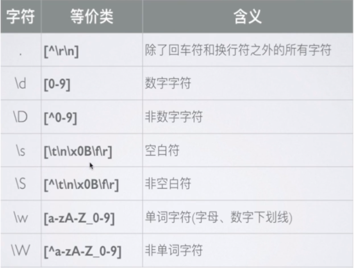
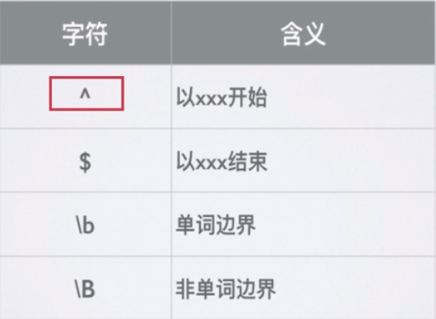
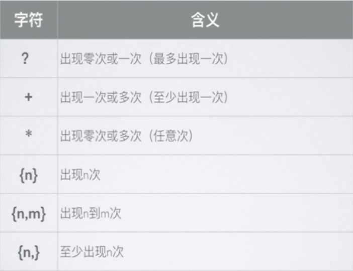

对每个人而言，真正的职责只有一个：找到自我。然后在心中坚守其一生，全心全意，永不停息。所有其他的路都是不完整的，是人的逃避方式，是对大众理想的懦弱回归，是随波逐流，是对内心的恐惧。
<!-- more -->
[正则表达式](https://regexper.com/)
## RegExp对象
```js
//字面量
var reg = /\bis\b/g;                
//构造函数
var reg = new RegExp('\\bis\\b','g');
```

## 修饰符
* g: globle 全文搜索
* i: ignore case 忽略大小写
* m: multiple lines 多行搜索

## 正则表达式由两种基本字符类型组成
* 原义字符
* 元字符:在正则表达式中有特殊含义的非字母字符

## 字符类
* 元字符的应用(构建类)
[abc] ：one of abc
* 取反
[^abc] :none of abc

## 范围类
* [a-z] [A-Z] [0-9]
* [a-zA-Z]
* [0-9-]
匹配0-9或者-

## 预定义类



## 量词


## 贪婪模式
```js
'12345678'.replace(/\d{3,6}/g,'X')  //"X78"
```

## 非贪婪模式
```js
'12345678'.replace(/\d{3,6}?/g,'X')  //"XX78"
```

## 分组
```js
Byron{3}  //Byronnn
(Byron){3} //ByronByronByron
```

## 或
```js
'ByronsperByrCasper'.replace(/Byr(on|Ca)sper/g,'X') //"XX"
```

## 反向引用
```js
'2016-12-20'.replace(/(\d{4})-(\d{2})-(\d{2})/g,'$2$3$1') //12-20-2016
```

## 忽略分组
```js
//分组前加?:
(?:Byron).(OK)
```

## 前瞻

```js
'a2*3'.replace(/\w(?=\d)/g,'X')  //X2*3
```

## RegExp属性(只读)
```js
var reg = /\w/;
reg.goloble; //false
reg.ignoreCase;  //false
reg.multiline;  //false
reg.sourse;  ///\w/
reg.lastIndex
```

## RegExp方法
```js
var reg = /\w/;
reg.test('s'); //true
reg.exec('s'); //s
reg.lastIndex
```
### exec非全局调用
* 返回数组
* 第一个元素是与正则表达式相匹配的文本
* 第二个元素是与RegExpObject的第一个子表达式相匹配的文本(如果有的话)，以此类推
```js
var reg = /\d(\w)\d/;
var ts = '1a2b3c4d5e';
var ret = reg.exec(ts);
console.log(reg.lastIndex + '\t' + ret.index + '\t' + ret.toString());
//0   0   1a2,a
//lastIndex不生效
```

### exec全局调用
```js
var reg = /\d(\w)\d/g;
var ts = '1a2b3c4d5e';
var ret = reg.exec(ts);
while(ret = reg.exec(ts)){
console.log(reg.lastIndex + '\t' + ret.index + '\t' + ret.toString());
}
//7 4   3c4,c
```

## 字符串对象方法
* String.prototype.search(reg)
```js
//将传入的参数尝试转换成正则表达式
'asddfasdfa'.search('s') //1
```

* String.prototype.match(reg)
```js
//全局调用
'a21s1d1a1d1'.match(/\d(\w)\d/g) //["1s1", "1a1"]
//非全局调用
var reg = /\d(\w)\d/;
var ts = '$1a2b3c4d5e';
var ret = ts.match(reg);
console.log(ret);  //["1a2", "a", index: 0, input: "1a2b3c4d5e"]
console.log(ret.index + '\t' + reg.lastIndex); //1  0
```

* String.prototype.split(reg)
```js
//传入字符串
'1,a,2,b,3,c'.split(',') //["1", "a", "2", "b", "3", "c"]
//传入正则表达式
'1a2b3c4d5e'.split(/\d/g); //["", "a", "b", "c", "d", "e"]
```

* String.prototype.replace(str,str)
* String.prototype.replace(reg,str)
* String.prototype.replace(reg,function)
1.匹配字符串
2.正则表达式分组内容，没有分组则没有该参数
3.匹配项在字符串中的index
4.原字符串
```js
'1a2b3c4d5e'.replace(/\d/g,function(match,index,origin){
    console.log(index);
    return parseInt(match) + 1;
    });  //"2a3b4c5d6e"
```
```js
'1a2b3c4d5e'.replace(/(\d)(\w)(\d)/g,function(match,group1,group2,group3,index,origin){
    console.log(match);
    return group1 + group3;
    });  //"12b34d5e"
```